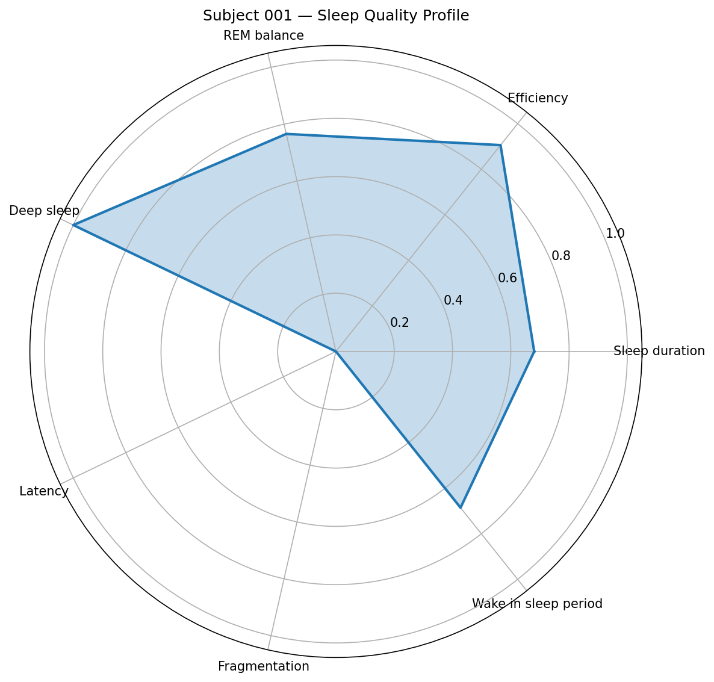
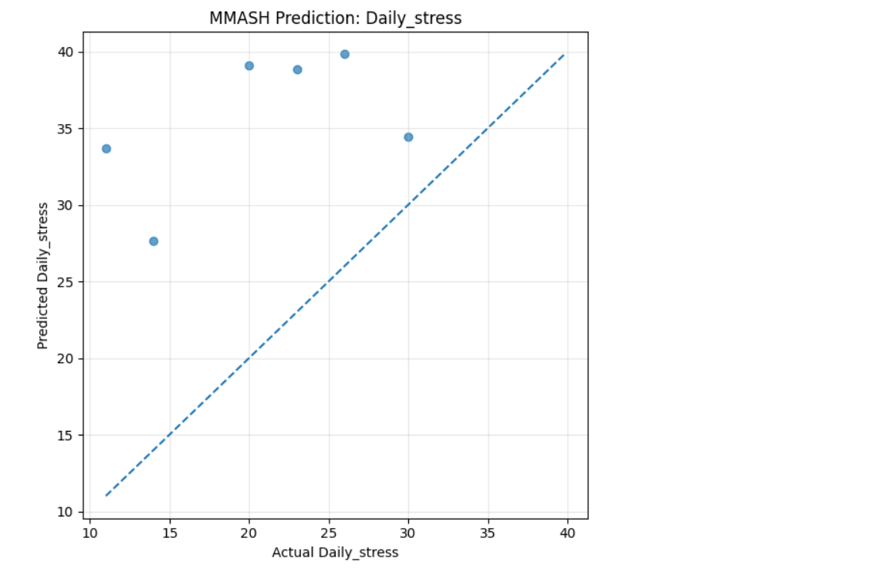
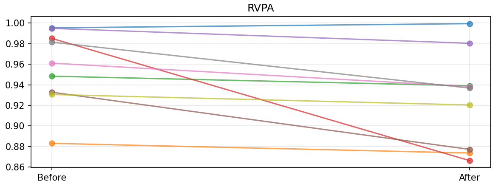
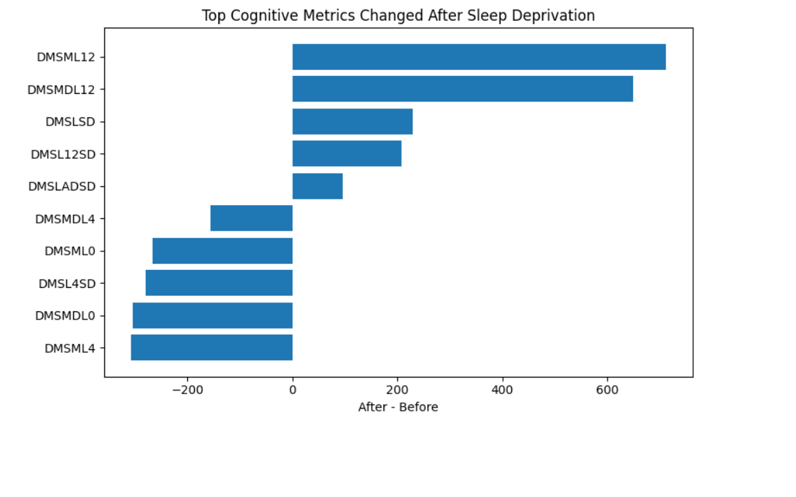

# Sleep, Mental Health and Cognition Analysis

This is a data analysis project focused on sleep patterns, sleep deprivation, cognitive performance, and mental health indicators.

The project combines several sleep-related datasets and demonstrates a full analytical workflow: data exploration, feature engineering, statistical analysis, and interpretable machine learning.

## Problem Statement

Sleep quality and sleep deprivation can affect cognitive performance, emotional state, and general well-being.

This project explores how sleep-related features can be extracted, analyzed, and connected with mental health and cognitive outcomes.

## Objectives

- Explore sleep EEG / EDF data.
- Build sleep-stage and sleep-feature datasets.
- Engineer features from sleep-related signals and summaries.
- Analyze the relationship between sleep and mental health indicators.
- Study the impact of sleep deprivation on cognitive performance.
- Prepare clean datasets and visual results for portfolio presentation.

## Project Structure

- `notebooks/01_sleep_edf_exploration.ipynb` — initial EDF sleep data exploration.
- `notebooks/02_sleep_edf_build_dataset.ipynb` — building a structured dataset from sleep EDF data.
- `notebooks/03_sleep_edf_feature_engineering.ipynb` — feature engineering for sleep analysis.
- `notebooks/04_mmash_sleep_mental_health.ipynb` — MMASH-based sleep and mental health analysis.
- `notebooks/05_sleep_deprivation_cognition.ipynb` — sleep deprivation and cognitive performance analysis.
- `data/raw/` — local raw data location.
- `data/processed/` — processed CSV datasets used by the notebooks.
- `data/external/` — external public datasets.
- `scripts/` — helper scripts.
- `requirements.txt` — Python dependencies.
- `LICENSE` — MIT license.

## Data

Large raw data archives are not included in the repository.

The MMASH archive is ignored by Git. To reproduce the full workflow locally, place the archive here:

`data/raw/MMASH.zip`

Processed CSV files used in the analysis are stored in:

`data/processed/`

The public CANTAB dataset is stored in:

`data/external/`

## Methods

- Exploratory data analysis
- Sleep-stage data processing
- Feature engineering
- Group comparison
- Correlation analysis
- Statistical testing
- Machine learning dataset preparation
- Visualization of sleep and cognition-related patterns

## Notebooks

- `01_sleep_edf_exploration.ipynb` — explore sleep EDF data and inspect signal structure.
- `02_sleep_edf_build_dataset.ipynb` — build a structured dataset from sleep EDF data.
- `03_sleep_edf_feature_engineering.ipynb` — generate sleep-related features for analysis.
- `04_mmash_sleep_mental_health.ipynb` — analyze sleep features in relation to mental health indicators.
- `05_sleep_deprivation_cognition.ipynb` — analyze sleep deprivation and cognitive performance outcomes.

## Results

The project demonstrates an end-to-end sleep analytics workflow:

- Raw and processed sleep-related datasets are organized.
- Sleep features are extracted and prepared for analysis.
- Mental health and cognition-related variables are explored.
- Processed datasets are prepared for modeling and interpretation.

## Visual Results

### Sleep Quality Profile

### MMASH Sleep and Stress Analysis

### Sleep Deprivation and Cognition

### Sleep Deprivation Feature Importance

## Tech Stack

- Python
- Pandas
- NumPy
- Matplotlib
- SciPy
- scikit-learn
- statsmodels
- MNE
- Jupyter Notebook

## How to Run 

Clone the repository:

git clone https://github.com/kva99kva-eng/Sleep.git

Go to the project folder:

cd Sleep

Create and activate a virtual environment:

python -m venv .venv

.venv\Scripts\activate

Install dependencies:

pip install -r requirements.txt

Run Jupyter Lab:

jupyter lab

Then run the notebooks in order from 01 to 05.

## Limitations

This is a learning-oriented data analysis project. It is not a clinical diagnostic tool and should not be used for medical decision-making.

## License

This project is licensed under the MIT License.

